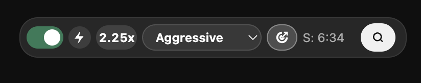
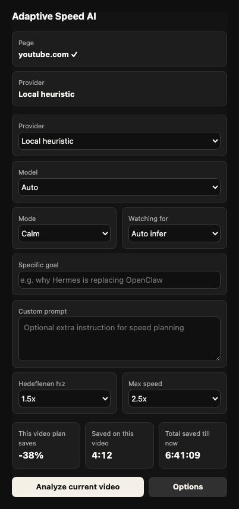
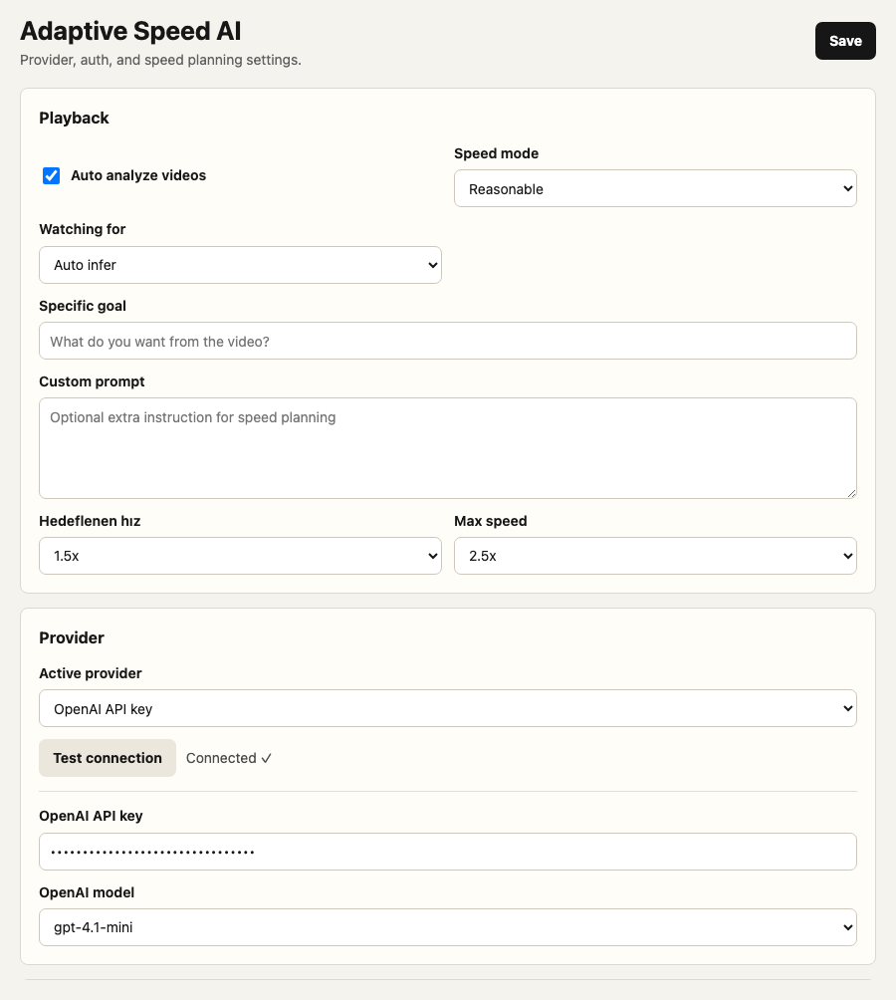

# Adaptive Speed AI for YouTube

**Skip the boring parts of any YouTube video. Automatically.**

A Chrome extension that reads the transcript, figures out what actually matters to you, and speeds up the rest — filler, recaps, sponsor reads, housekeeping — while slowing back down for the parts you came to watch.

<p>
  
  
  
</p>

## What it does

- ⏩ Auto-speeds skippable parts, slows down for the parts that match what you're watching for
- 🎯 Ask it to "find the answer" or "learn deeply" — it protects those sections
- 🔒 Bring your own OpenAI / OpenRouter / Gemini key — key stays on your machine
- 🎬 One control dock on the YouTube player — colored progress bar shows the whole plan at a glance

## See it in action

**Right on the YouTube player** — the progress bar is pre-colored with the whole speed plan, and a compact dock lets you toggle it, pick a mode, and see time saved live.




**Toolbar popup and options** — full control over provider, speed mode, and viewer goal.

| Popup | Options |
|---|---|
|  |  |

## How it works

1. **Read** — pulls the video's transcript (captions, with a silent fallback if hidden).
2. **Understand** — a planner (free local mode or your AI provider) scores each chunk: essential vs. skippable.
3. **Play** — playback speed adapts chunk by chunk, live, with the plan visible right on the progress bar.

## Get it running

```bash
git clone https://github.com/mertcanmerkit/adaptive-speed-ai-for-youtube.git
```

1. Open `chrome://extensions`
2. Enable **Developer mode**
3. **Load unpacked** → select `outputs/adaptive-speed-ai-extension`
4. Open any YouTube video with captions — it just works, no key required

Want a smarter planner? Add an OpenAI, OpenRouter, or Gemini key in **Options**. Your key stays on your machine.

## Status

Alpha. See [`outputs/adaptive-speed-ai-extension/README.md`](outputs/adaptive-speed-ai-extension/README.md) for the full feature list, provider notes, and known limitations.

## Project layout

- `outputs/adaptive-speed-ai-extension/`: Chrome extension source and product docs.
- `docs/`: durable project memory, validation, adoption, and handoff notes.
- `knowledge/README_FOR_AI.md`: read-first context for future AI sessions.
- `source_of_truth/`: manifest for durable source material.
- `work/`: local scratch space, intentionally ignored except for `work/README.md`.
- `scripts/ai_project_check.py`: project memory and privacy validation.

## For developers / AI agents

This repo doubles as a durable AI-agent project. Start with [`AGENTS.md`](AGENTS.md) — canonical instruction file, links to `ai-project.yaml`, `docs/`, and validation scripts.

```bash
python3 scripts/ai_project_check.py
node --check outputs/adaptive-speed-ai-extension/background.js
node --check outputs/adaptive-speed-ai-extension/content.js
node --check outputs/adaptive-speed-ai-extension/popup.js
node --check outputs/adaptive-speed-ai-extension/options.js
python3 -m json.tool outputs/adaptive-speed-ai-extension/manifest.json
unzip -tq outputs/adaptive-speed-ai-extension.zip
```

## Privacy

This project is private by default. Do not push to a public remote. Do not commit API keys, ChatGPT tokens, browser profiles, cookies, local Chrome state, or unrelated research clones.

Repo URL: `https://github.com/mertcanmerkit/adaptive-speed-ai-for-youtube`
